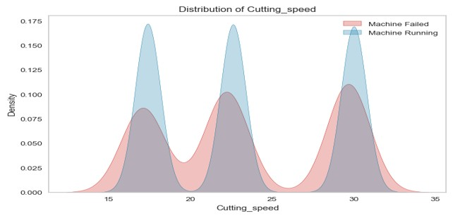
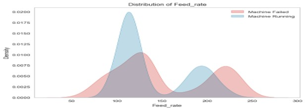
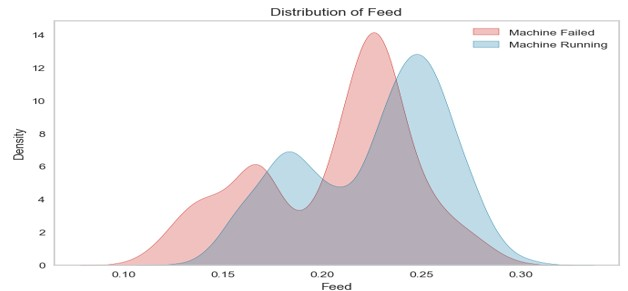
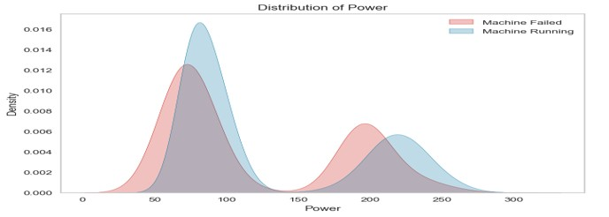
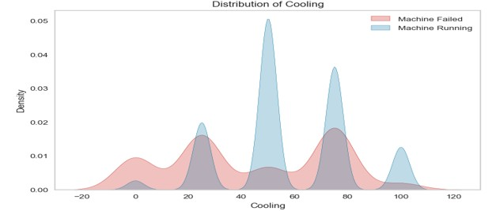
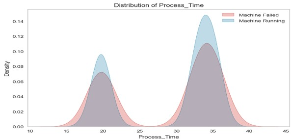
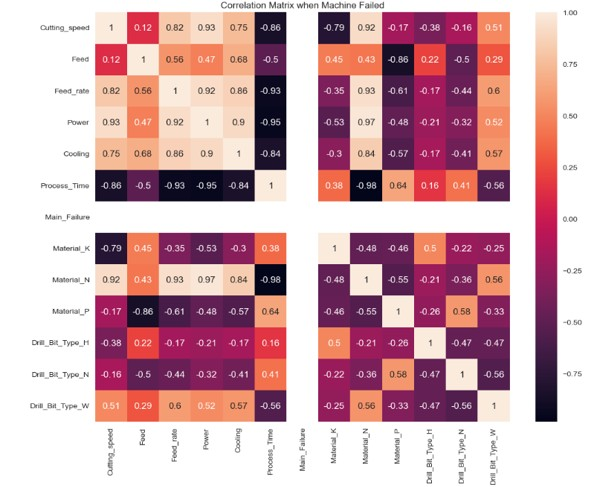
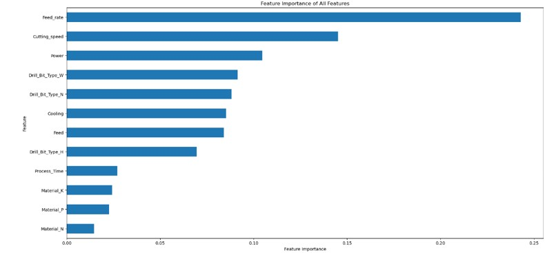

<h1 align="center">🔧 Predictive Maintenance & Machine Failure Forecasting</h1>

  <strong>Machine Learning • Imbalanced Learning • Feature Engineering • Model Optimisation • Streamlit Deployment</strong>

  An end-to-end predictive analytics system using Random Forest, XGBoost, SMOTE, and hyperparameter optimisation to forecast drilling machine failures with high recall and near-perfect AUC.

  
  
  
  
  
  
  

---

  <em>This project demonstrates enterprise-level predictive analytics, model optimisation, and ML application development.</em>

---

## 📌 Project Overview

This project builds a **predictive maintenance system** that forecasts drilling machine failures using real operational data (20,000+ cycles, with a minority failure class).

It demonstrates:

- Handling of **imbalanced classification**  
- Advanced **feature engineering**  
- Evaluation and optimisation of **tree-based ensemble models**  
- **Interpretability** through feature importance and permutation analysis  
- Deployment of the final model as an interactive **Streamlit web application**

---

## 🎯 Objectives

- Predict equipment failures *before* they occur  
- Achieve **high recall** on the failure class (no missed failures)  
- Understand which operational factors drive failure risk  
- Deploy a practical tool that operators/engineers can use in real time  

---

## 🛠 Tech Stack

- **Language:** Python  
- **ML Libraries:** scikit-learn, XGBoost, imbalanced-learn, Optuna  
- **Data Handling:** pandas, NumPy  
- **Visualisation:** matplotlib, seaborn  
- **Deployment:** Streamlit  
- **Environment:** Jupyter Notebook / Python scripts  

---

flowchart TD
    A --> B[📁 Raw Sensor Data Drilling Operations] --> B[🔍 Exploratory Data Analysis - Distributions - Correlations - Failure patterns]

    B --> C[🧹 Data Preparation - Train/Test split - Scaling - Handle imbalance (SMOTE)]

    C --> D[🤖 Baseline Models - Random Forest - XGBoost]

    D --> E[⚙️ Model Optimisation - SMOTE + Random Forest - SMOTE + Optuna - SMOTE + RandomizedSearchCV]

    E --> F[📊 Evaluation - ROC-AUC - Recall (failure class) - Confusion matrix]

    F --> G[🧠 Interpretation - Feature importance - Permutation importance - Failure driver analysis]

    G --> H[🌐 Deployment Streamlit Web App - Input sliders/forms - Failure probability - Actionable output]
---

# 📊 Analytics Process

This section summarises the complete analytical workflow used in this predictive maintenance project from understanding the dataset to developing optimised machine learning models and deploying the final solution through Streamlit. The analysis transforms raw drilling-machine operational data into actionable insights for failure prediction.  

---

## 🔍 1. Dataset Overview

The dataset consists of **20,000 drilling operations**, with each record containing 10 operational features and a binary failure indicator. The breakdown is:

- **1,001 failure cases** (≈5.0%)  
- **18,999 successful operations** (≈95.0%)

This substantial class imbalance strongly influenced the modelling strategy, requiring the use of SMOTE and Borderline-SMOTE to ensure balanced representation during training.  

---

## 📈 2. Exploratory Data Analysis (EDA)

Exploratory analysis focused on understanding the operational conditions associated with failures.

### **Key Observed Patterns**

- **Higher cutting speeds** increased failure likelihood. 

- **Feed and feed rate** values were significantly higher in failure cases, suggesting mechanical overload.  

- **Power consumption spikes** were observed shortly before failures. 

- **Cooling variability** indicated overheating or excessive thermal load. 

- **Longer process times** correlated moderately with increased failure probability. 

These patterns informed feature engineering decisions and validated the relevance of sensor metrics in predicting machine health.

---

## 🔗 2.1 Correlation Analysis
 

### **Strong Positive Correlations**
- Cutting speed ↔ Feed rate: **0.82**  
- Cutting speed ↔ Power: **0.93**  
- Material_N ↔ Feed rate: **0.93**  
- Material_N ↔ Power: **0.97**  

### **Failure-related Correlations**
- Material_P ↔ Failure: **0.64**  
- Process time ↔ Failure: **0.38**

These findings show that the physical workload on the machine (speed, feed, power) directly increases the mechanical stress leading to failures.

---

## 🤖 3. Model Development

Multiple machine learning models were trained, including:

- **Random Forest**
- **Extreme Gradient Boosting (XGBoost)**  
- Data resampling with **SMOTE** and **Borderline-SMOTE**
- Hyperparameter optimisation using **RandomizedSearchCV** and **Optuna**

This modelling framework addressed the challenge of imbalanced classes while improving model reliability and failure detection recall.  
---

## 🧪 4. Model Performance

Three main model configurations were tested:

### **Random Forest + SMOTE**  
- ROC-AUC: **0.997–0.998**  
- Recall (failure class): **1.00**  

### **Random Forest + SMOTE + Optuna**  
- ROC-AUC: **0.997**  
- Recall: **1.00**

### **Random Forest + SMOTE + RandomizedSearchCV**  
- ROC-AUC: **0.998**  
- Recall: **1.00**  

These results demonstrate exceptional predictive capability in every optimised configuration, the model achieved **100% recall**, detecting all true failures, which is essential in high-risk predictive maintenance environments.  
---

## 🧩 5. Confusion Matrix Interpretation

Across optimised models:

- **True Positives:** All failure cases correctly identified  
- **False Negatives:** **0** (the most critical metric)  
- **False Positives:** Low and acceptable  
- **True Negatives:** High accuracy  

The models meet industrial reliability requirements where missing a failure can be extremely costly or dangerous.  

---

## 🌟 6. Feature Importance

Feature importance analysis revealed:

1. **Feed Rate (vf)**  
2. **Cutting Speed (vc)**  
3. **Spindle Speed (n)**  
4. **Power Consumption (Pc)**  
5. **Cooling Level**

These features were the strongest contributors to failure prediction, supporting the mechanical interpretation of drilling stress and thermal load.  
---

## 🔄 7. Permutation Importance

Permutation importance confirmed the ranking above by showing that shuffling key features caused significant drops in model performance especially **Feed Rate** and **Cutting Speed**, which act as core predictive signals.  

---

## 🖥️ 8. Deployment Using Streamlit

The final optimised model was deployed using a **Streamlit application**, enabling real-time predictions in an interactive environment.  

### Streamlit App Features:

**App:** *[PredictiveApp](https://a8adtfzxaygmffjjqe5ums.streamlit.app)*

#### **8.1 Input Section**
Users manually enter operational parameters (speed, feed rate, cooling level, etc.).

#### **8.2 Preview Section**
Displays a snapshot of loaded or streamed operational data.

#### **8.3 Prediction Section**
Real-time prediction interface that outputs:

- Prediction condition  
- Probability of failure  
- Recommended maintenance action  

#### **8.4 Results Section**
- Visualises outcome metrics and supports human-in-the-loop decision-making.

- This deployment transforms the model into a **practical industrial tool**.

---

# ⭐ Conclusion

This project demonstrates:

- End-to-end analytical workflow from EDA to deployment  
- Handling of imbalanced data using SMOTE and Borderline-SMOTE  
- Advanced model tuning (Optuna, RandomizedSearchCV)  
- Exceptional model performance (ROC-AUC 0.998, Recall 1.00)  
- Feature and permutation importance for interpretability  
- Real-time deployment using Streamlit  

